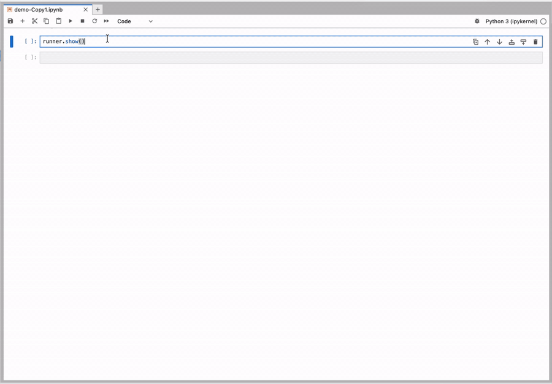

# 005 - SQL Runner with CodeMirror (인라인 임베드 · 실행 가능)

> **한 줄 요약**: CodeMirror 5.65.16 을 single-file `.py` 안에 통째로 인라인하여 Jupyter 셀에서 **에디터 자체에 syntax highlight + popup 자동완성** 이 적용되는 SQL Runner. ▶ 실행 (Cmd/Ctrl+Enter) 으로 Python 콜백 호출.

## 시연



## 005 / 006 선택 가이드

| 항목 | **005 (CodeMirror 노트북, 이 변환물)** | 006 (Textual TUI) |
|---|---|---|
| 환경 | Jupyter 노트북 | 터미널 (ssh 친화) |
| 브라우저 / Trust | ✅ / **Trust 필수** | ❌ |
| **에디터 자체** syntax 색 | ✅ (CM dracula) | ✅ (Textual native, tree-sitter) |
| inline 자동완성 | ✅ Ctrl+Space + 자동 popup | ✅ 인라인 OptionList (Tab) |
| 컨텍스트 추천 패널 | ✅ | ✅ |
| 커서 위치 정밀 인서트 | ✅ | ✅ |
| ▶ 실행 → Python 콜백 | ✅ Cmd/Ctrl+Enter | ✅ Ctrl+R / F5 |
| 결과 자동 표 렌더 (모든 컬럼) | ✅ pandas HTML | ✅ Textual DataTable |
| 후속 분석 | `runner.last_result` · `runner.history()` (timestamp + 클립보드 복사) | DataTable 안에서만 |
| 의존성 | ipywidgets + IPython + CM 인라인 | textual + rich |
| 파일 크기 | **~310KB** (CM 번들 포함) | ~30KB |

**언제 005 를 쓰나** — 노트북 안에서 진짜 IDE 같은 편집 체감(에디터 내부 syntax color · 라인 번호 · Ctrl+Space) + 결과를 다음 셀로 넘겨 후속 분석.
**언제 006 을 쓰나** — ssh / 원격 터미널 친화, Trusted notebook 정책이 부담스럽거나 가장 가벼운 단일 파일을 원할 때.

## 원본 출처

| 항목 | 값 |
|---|---|
| 라이브러리 | [CodeMirror 5.65.16](https://github.com/codemirror/codemirror5) (legacy v5 — 의도적으로 v6 미사용. v6 는 ESM 번들러 필요) |
| 라이선스 | MIT (`LICENSE` 참조 — CodeMirror 원본 라이선스 복제) |
| 포함 모듈 | core / `mode/sql` / `addon/hint/show-hint` / `theme/dracula` |
| 합계 minified bundle | ~244 KB (raw, gzip 적용 시 더 작음) |

## 기능 요약

- **`SQLRunnerCM(on_execute=fn).show()` 한 줄로 실행 가능 위젯 렌더**
- **레이아웃** (HBox 좌·우 분할):
  - 좌: 📚 Entity 패널 — **단일 HTML 위젯**(검색창 + 테이블 그룹). 위젯 객체(W.Button) 를 만들지 않으므로 **수백 컬럼 스키마도 즉시 렌더**. 검색창에 입력하면 JS 자체 필터로 매치되는 테이블/컬럼만 즉석 표시 (Python round-trip 0). 클릭 → CM 의 **현재 커서 위치** 에 인서트 (마지막 부분 단어가 prefix 면 자동 치환)
  - 우: SQL Runner 패널
    - **CodeMirror 5 에디터** — SQL mode + dracula 다크 테마 + 라인 번호 + 라인 wrap + 자동 들여쓰기
    - 컨텍스트 인식 자동완성 popup (Ctrl/Cmd+Space, 식별자 입력 시 자동)
    - **💡 추천 칩 패널** — popup 과 별개로 항상 보이는 컨텍스트 칩. 클릭 시 CM 의 커서 위치에 인서트
    - **`▶ 실행`** / `⬇ CSV·Excel 다운로드` (브라우저) / **`💾 CSV·Excel 파일 저장`** (cwd) / `🗑 지우기` 버튼
    - 📤 Output 위젯 — DataFrame 의 **모든 컬럼** 까지 잘리지 않고 표 렌더 (`pd.option_context` 적용)
    - **단축키**: Cmd/Ctrl+Enter = ▶ 실행, Ctrl/Cmd+Space = 자동완성, Tab = 들여쓰기
- **결과 출력 두 가지 경로**:
  - `⬇ CSV / Excel 다운로드` — base64 data URI + 자동 클릭 → 브라우저 다운로드 폴더로. 클립보드 차단 환경에서도 동작.
  - **`💾 CSV / Excel 파일 저장`** — 노트북 작업 디렉토리(`os.getcwd()`) 에 `sql_result_<ts>.csv`/`.xlsx` 로 직접 저장 후 `IPython.FileLink` 로 클릭 가능 링크 안내. **다음 셀에서 `pd.read_csv(...)` 로 다시 읽거나 사내 파일 공유에 사용** 하기 좋음.
- **컨텍스트 인식 자동완성** (005 의 anchor 정책을 JS + Python 양쪽으로 재현):
  - `FROM` / `JOIN` 다음 → 테이블
  - `SELECT` 다음 → 컬럼 + `*` + 함수
  - `WHERE` / `AND` / `OR` / `ON` / `GROUP BY` / `ORDER BY` / `HAVING` 다음 → 컬럼
  - `table_name.` 입력 시 → 해당 테이블 컬럼만 한정
  - 시작/모호 → 키워드 + 함수 + 테이블 + 컬럼 종합
  - **fallback 키워드/함수** — 어느 컨텍스트에서나 `WHE`, `GR`, `JOI` 같은 부분 입력에 매치되도록 모든 KEYWORDS / FUNCTIONS 가 후보 끝에 자동 추가됨

## 다양한 백엔드와의 연동

`on_execute` 는 `(sql: str) -> Any` 시그니처의 임의 함수면 됩니다 — sqlite 에 한정되지 않음.

| 백엔드 | 패턴 | 반환 |
|---|---|---|
| SQLite + pandas | `lambda sql: pd.read_sql(sql, conn)` 또는 `with_sqlite()` 헬퍼 | DataFrame |
| SQLite raw cursor | `conn.row_factory = Row; conn.execute(sql).fetchall()` | `list[dict]` (자동 DataFrame 변환) |
| 메모리 dict / 캐시 | 자체 query 파서 | dict / list[dict] |
| pandas DataFrame | `df.query(...)` / `pandasql.sqldf(...)` / `duckdb.sql(...).df()` | DataFrame |
| REST API 사내 엔진 | `requests.post(api_url, json={'sql': sql}).json()['rows']` | list[dict] |
| Spark / Snowflake / 사내 SQL | 해당 클라이언트의 `.sql(...).toPandas()` 등 | DataFrame |

자세한 시연은 `demo.ipynb` 의 §3 참고.

## 의존성

| 사용 | 패키지 | 용도 |
|---|---|---|
| 필수 | `ipywidgets` | 위젯 framework + Python ↔ JS 데이터 동기화 |
| 필수 | `IPython` | display 통합 |
| 선택 | `pandas` | `on_execute=lambda sql: pd.read_sql(sql, conn)` 패턴 시 |
| 전이 | (없음) | sqlite3 stdlib · 외부 의존 추가 0 |

> CodeMirror 자체는 `.py` 안에 raw-string 으로 인라인되어 있어 별도 패키지 설치 불필요.

## 사용 예시

### 빠른 시작 — 편의 메서드

```python
from sql_codemirror import SQLRunnerCM

runner = SQLRunnerCM.with_sqlite("./demo.db")    # ⭐ thread-safe 자동 처리
runner.set_query("SELECT * FROM users LIMIT 10;")
runner.show()
```

`with_sqlite()` 는 매 ▶ 실행마다 새 connection 을 열고 닫아 ipywidgets 의 thread 이슈를 자동 회피합니다 (pandas 필요).

### 직접 콜백 — 공유 connection 패턴

```python
import sqlite3, pandas as pd
from sql_codemirror import SQLRunnerCM

# ⚠ ipywidgets 버튼 콜백은 다른 스레드에서 실행되므로 check_same_thread=False 필요
conn = sqlite3.connect("./demo.db", check_same_thread=False)

runner = SQLRunnerCM(on_execute=lambda sql: pd.read_sql(sql, conn))
runner.from_sqlite("./demo.db")
runner.show()
```

### `on_execute` 콜백 시그니처

```python
def on_execute(sql: str) -> Any:
    # CodeMirror → hidden Textarea 동기화로 항상 최신 텍스트가 전달됨
    # 반환값 None → "실행 완료 (반환값 없음)" 표시
    # 반환값 있으면 IPython.display(value) 로 Output 위젯에 렌더
    return pd.read_sql(sql, my_connection)
```

콜백 미등록 시 ▶ 실행 클릭 → 안내 메시지 + SQL 출력만 표시 (시연용).

### 후속 분석 — `runner.last_result` / `runner.history()`

▶ 실행 후 `runner` 객체에 결과가 보관되어 다음 셀에서 곧장 후속 분석 가능:

```python
runner.show()      # 사용자가 ▶ 실행을 누름
# (다음 셀)
df = runner.last_result            # 마지막 실행 결과 (DataFrame 등)
print(df.describe())
df.to_parquet("/tmp/result.parquet")

runner.last_query                  # 마지막으로 실행한 SQL 문자열
runner.last_error                  # 실패했다면 Exception, 성공이면 None
runner.query                       # ↘ 현재 에디터 안의 SQL (실행 안 했어도 OK)
runner.result                      # last_result 의 짧은 alias

# ── history: list 인 동시에 callable ──
runner.history                     # [{timestamp, query, result, error, …}] 전체
runner.history[-1]["result"]       # 마지막 실행 결과
runner.history[0]["query"]         # 첫 실행 SQL
len(runner.history)                # 실행 횟수

# ── history() — 날짜별 sidebar + 클립보드 복사 ──
runner.history()                   # 전체 history (좌측 날짜 sidebar · 항목별 미리보기)
runner.history(n=10)               # 최근 10건만 (그래도 날짜별 그룹핑됨)
runner.history(full=False)         # 결과 미리보기 생략, SQL/timestamp 만
md = runner.history.to_markdown()  # 전체 history 를 markdown 텍스트로 직렬화
```

`runner.history()` 는 좌측에 **📅 날짜별 sidebar** + 우측에 해당 날짜의 entry 목록 (timestamp · SQL · 결과 미리보기) 으로 렌더됩니다. **항목별 [📋 SQL 복사]** + 상단 **[📋 전체 history 복사 (markdown)]** 버튼 포함. 클립보드 권한이 차단된 환경에서는 자동으로 hidden textarea + `execCommand('copy')` 폴백을 사용합니다.

### 세션 연속성 — 파일 기반 history (`history_dir`)

```python
runner = SQLRunnerCM(
    on_execute=fn,
    history_dir=".sql_runner_history",   # 기본값. None 이면 in-memory only
)
```

`history_dir` 이 지정되면:

- ▶ 실행마다 **`<dir>/YYYY-MM-DD.jsonl`** 파일에 append-only 로 entry 저장 (1일 1파일)
- 다음 노트북 세션에서 `SQLRunnerCM(...)` 만 다시 만들면 과거 history 자동 로드
- 결과 본체는 저장 X — `timestamp` · `query` · `status` · `error_msg` · `row_count` · `col_count` 만 (DataFrame 직렬화 부담 + 폐쇄망 데이터 보안)
- 이전 세션 entry 는 UI 에서 **회색 좌측 border + `[이전 세션]` 배지** 로 표시

폐쇄망 친화: JSONL 텍스트 파일 한 종류 (audit/diff 가능), 외부 의존 없음.

### SQL 문법 검증 (자동)

에디터 입력이 변경될 때마다 **내장 `validate_sql()`** 이 호출되어 ✓/❌ 상태가 에디터 아래에 표시됩니다. 검증 실패 시 ▶ 실행 버튼이 비활성화되어 잘못된 SQL 의 실행을 미연에 차단합니다.

- 검사 항목: 빈 문자열, 알 수 없는 시작 키워드, 따옴표 균형 (`'` `"`), 괄호 균형 `( )`
- 외부 의존 없음 (sqlparse / sqlglot 미사용) — 폐쇄망 친화
- 깊은 grammar 검증이 필요하면 `SQLRunnerCM(on_execute=fn, on_validate=my_validator)` 로 사용자 정의 콜백 주입. `(ok: bool, message: Optional[str])` 튜플을 반환

```python
def strict_validator(sql: str):
    # 사내 SQL 정책 검사 (예: SELECT * 금지, LIMIT 필수 등)
    if "SELECT *" in sql.upper():
        return False, "SELECT * 사용 금지 (필요 컬럼만 명시)"
    return True, None

runner = SQLRunnerCM(on_execute=fn, on_validate=strict_validator)
```

### 직접 등록

```python
from sql_codemirror import SQLRunnerCM

runner = SQLRunnerCM(on_execute=my_executor)
runner.add_table("users", ["id", "name", "email"], description="사용자 마스터")
runner.add_table("orders", [
    ("id", "INT"),
    ("user_id", "INT"),
    ("amount", "REAL"),
    ("status", "TEXT"),
])
runner.show()
```

### 다중 schema (선택)

같은 이름의 테이블이 여러 환경(예: `public.users`, `staging.users`) 에 공존하는 경우, `schema=` 인자로 분리 등록할 수 있습니다. **단일 schema 만 쓰면 사이드바는 기존과 동일한 flat 모양** 으로 그대로 보입니다 — schema 헤더는 schema 가 둘 이상일 때만 자동으로 등장합니다.

```python
runner = SQLRunnerCM(on_execute=my_executor)
# 기본 schema ("main")
runner.add_table("users",  ["id", "name", "email"])
runner.add_table("orders", ["id", "user_id", "amount"])
# 별도 schema 추가 — schema= 인자
runner.add_table("users",  ["id", "name", "tier"], schema="staging")
runner.from_dict({"events": ["id", "user_id", "ts"]}, schema="analytics")
# from_sqlite / from_dataframes 도 동일하게 schema= 인자 수용
runner.show()
```

사이드바와 자동완성에서:

- **사이드바**: `📁 main`, `📁 staging`, `📁 analytics` 그룹으로 묶여 표시 (헤더 클릭으로 접기/펼치기). 동명 테이블이 여러 schema 에 있으면 클릭 시 자동으로 `staging.users` 형태로 인서트.
- **자동완성 popup (FROM/JOIN 컨텍스트)**: 첫 줄에 schema 후보 (📁 main, 📁 staging, 📁 analytics) 가 먼저 뜨고, schema 를 선택하면 `main.` 인서트 후 popup 이 자동으로 다시 떠 그 schema 의 테이블만 보여줍니다 (2-step 흐름).
- **컬럼 qualifier**: 기존 `alias.column` / `table.column` 외에도 `schema.table.column` 3-segment 입력에 컬럼 자동완성이 동작.

### 단축키 정리

| 키 | 동작 |
|---|---|
| **Cmd / Ctrl + Enter** | ▶ 실행 (= on_execute 호출) |
| **Cmd / Ctrl + Space** | 자동완성 popup |
| **식별자 입력 중** | 자동완성 popup 자동 노출 (.도 trigger) |
| **Tab** | 들여쓰기 (블록 선택 시 indent 추가) |

## 파일 구조

```
005-sql-codemirror-runner/
├── README.md
├── sql_codemirror.py        # ⭐ single-file 반입 단위 (~310KB, CM 인라인 포함)
├── metadata.json
├── LICENSE                  # MIT (CodeMirror 원본 라이선스 복제)
├── _build.py                # (build only) 자산 → single-file 생성기
├── _template.py             # (build only) wrapper Python 템플릿
├── _assets/                 # (build only) CodeMirror v5.65.16 원본 자산
│   ├── codemirror.min.js
│   ├── codemirror.css
│   ├── sql.min.js
│   ├── show-hint.min.js
│   ├── show-hint.css
│   ├── dracula.css
│   └── LICENSE
└── demo.ipynb               # 노트북 데모 (실행 가능 시나리오 포함)
```

> **반입 단위는 `sql_codemirror.py` 하나** 입니다. `_build.py` / `_template.py` / `_assets/` 는 빌드 시점에만 사용되며 폐쇄망에 반입할 필요가 없습니다.

## 폐쇄망 친화 체크

| 항목 | 상태 |
|---|---|
| 외부 네트워크 / CDN | ❌ 없음 (CSS/JS 모두 raw-string 인라인) |
| `<link href>` / `<script src>` | ❌ 없음 |
| `//# sourceMappingURL=` 외부 .map 참조 | ❌ 없음 (build 시 제거) |
| 새 서버 / 포트 | ❌ 없음 |
| 바이너리 영속화 | ❌ 없음 |
| 단일 반입 단위 | `sql_codemirror.py` 한 파일 |
| 추가 패키지 | ipywidgets + IPython (이미 스택 포함) |

## 알려진 제약 / 한계

- **Trusted notebook 필요** — JupyterLab 의 untrusted 노트북에서는 인라인 `<script>` 가 차단되어 CodeMirror 가 mount 되지 않음 (`File → Trust Notebook`). 이 환경 제약이 부담이라면 **006 (Textual TUI)** 사용 권장.
- **파일 크기 ~310KB** — TUI 변환물(006, ~30KB) 보다 약 9배. 보안 검토 분량이 늘어남. 다만 **CodeMirror MIT 라이선스 한 건만 추가 검토** 하면 끝.
- **CodeMirror 5 (legacy)** — v6 가 아닌 v5 를 의도적으로 선택. v6 는 ESM 번들러(rollup/esbuild) 가 필요해 raw-string 인라인이 사실상 불가. v5 는 단일 IIFE 번들이라 인라인 적합. v5 는 유지보수 모드지만 SQL 모드/show-hint 만 쓰는 본 용도엔 충분.
- **CTE / 서브쿼리 alias 미지원** — 다음과 같은 패턴은 자동완성 매핑이 안 됨 (TODO):
  - `WITH cte AS (...)` — CTE 본명 / 컬럼 추론. 명시 컬럼 리스트 (`WITH cte(a, b) AS ...`) 와 단순 SELECT 리스트만 우선 다루는 식으로 단계적 구현 가능. 별칭 없는 표현식·`SELECT *` 처리 등 부작용을 따져야 해 보류.
  - `FROM (SELECT ...) AS sub` — 서브쿼리 alias. 괄호 균형 + 내부 SELECT 컬럼 추론 필요.
- **콤마 join · schema-qualified 는 지원** — `FROM x, y` / `FROM public.orders AS o` 등은 정상 인식.
- **comm channel 비공개 사용** — CM 의 변경값을 hidden ipywidgets.Textarea 의 native `input` 이벤트로 동기화. 향후 ipywidgets 가 내부 동기 메커니즘을 변경하면 깨질 수 있음 (현재 v7 / v8 까지 안정).
- **CodeMirror v5 EOL 주시** — 보안 패치는 들어오지만 새 기능은 v6 로만 추가됨. 본 변환물은 SQL 자동완성/하이라이트만 쓰므로 큰 영향 없음.

## 빌드 (관리자용)

`_assets/` 의 자산을 갱신하거나 wrapper 코드를 수정한 후 단일 파일을 재생성:

```bash
# 리포 루트의 통일 .venv 를 사용
cd 005-sql-codemirror-runner
../.venv/bin/python _build.py
# → sql_codemirror.py 가 갱신됨
../.venv/bin/python sql_codemirror.py    # 자체 self-check (번들 크기 등)
```

`_assets/` 의 minified 파일은 [jsdelivr CDN](https://cdn.jsdelivr.net/npm/codemirror@5.65.16/) 등에서 받아 두면 됩니다 (빌드 시점 1회만 외부 네트워크 필요, 산출물에는 흔적 없음).
